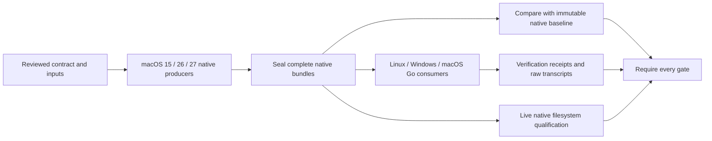

# Native evidence and qualification

The harness compares the current Go implementation with independently observed
Apple behavior. Updating Go, dependencies or CI reporting must not rewrite a
historical native result. A passing capture job also must not imply that the Go
implementation matches it.

## Evidence boundaries

| Record | Purpose | What invalidates it |
| --- | --- | --- |
| Qualification contract | Complete cases, native profiles, consumers, prerequisite families and comparator | Changed inputs or comparison obligations |
| Native observation | Native input/result bytes for every declared case | Changed native bytes, incomplete inventory or incompatible contract |
| Capture provenance | Original C/probe, SDK, ASTs, environment and artifacts | Corrupted or missing original bytes; an incorrect native profile |
| Execution receipt | Current revision, CI run/attempt, Go version, checkout bytes and verification results | Another run/attempt/revision, incomplete verification or altered artifacts |

Original source bytes are verified against their original SHA-256 hashes. They
are never replaced with today's files. Current execution hashes are checked
against the receiving checkout. They do not become prerequisites of an old
native observation.

Native semantic comparison uses the family-specific comparator. Raw captures
remain available when a comparator excludes documented incidental fields, such
as clock values and allocated inode numbers. Live tests continue checking the
relationships and invariants those fields represent.

Baseline drift and implementation mismatches are different failures. A baseline
failure must leave fresh observations available to consumers so CI can report
both. Producers finish native collection and cleanup before publishing their
completion marker. Partial producer output remains diagnostic data.

## Integrity and completion

The internal `nativeevidence` package validates declared cases, profiles,
prerequisites and consumers. Native blobs use SHA-256 names, avoiding transport
problems with native filenames. Consumers reject missing or corrupted blobs,
wrong OS profiles, mixed revisions or CI attempts, and incomplete inventories.
Their receipts bind the exact observation and their verification artifacts.
Aggregation requires every declared producer–consumer combination and verifies
prerequisite observation identities.

The existing codesign shard receipts remain responsible for exact nested-test
inventories, coverage, instrumentation and foreign outputs. Integrating the new
native contract does not relax those obligations. Production builds continue to
use GoReleaser.

## Retained data

A retained catalog pins each original capture file and its source set. Original
source archives preserve the bytes that generated the observation, including
historical module files. The shared content-addressed archive deduplicates equal
bytes without changing their identities.

Legacy captures may lack original headers, ASTs or intermediate binaries that
were never retained. Such omissions must be listed explicitly. Available original
bytes can still support narrowly scoped historical checks; an incomplete archive
cannot pass the complete-originals gate or replace a fresh producer. Recovering
genuine old bytes and producing fully archived fresh evidence are distinct tasks.

## Remaining migration

- Inventory every native fixture, producer, consumer and CI gate in both repos.
- Recover and verify missing historical inputs, or keep their qualification
  limitations explicit. Never manufacture a matching source snapshot.
- Separate the remaining native collectors from Go results and baseline checks.
- Replace whole-parent-capture dependencies with the exact native inputs consumed.
- Consolidate event workflows and duplicate captures into declared producer and
  consumer dependencies. Preserve all unique acceptance obligations.
- Make every required Linux, Windows and macOS consumer use its current run's
  complete producer artifacts, with no stale-fixture fallback.
- Publish reviewable native baseline proposals, with provenance-only differences
  separated from behavioral and input differences.
- Run missing/corrupt/wrong-profile/mixed-attempt/partial/cancellation regressions
  and keep per-package and applicable per-file coverage above 95%.
- Qualify both repositories in published CI before closing this migration or
  declaring Phase 02 complete.

The shared validator and the APFS owned-compression producer–consumer migration
are implemented locally. The remaining families, workflow consolidation and
codesign consumer migration are still outstanding; this document is not a claim
that Phase 02 is complete.
