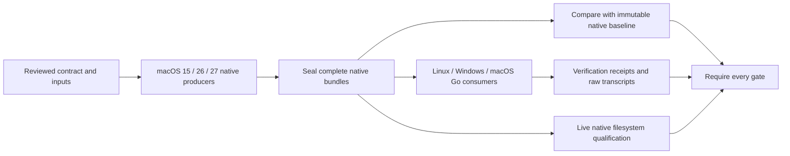

# Native evidence and qualification

The harness compares the current Go implementation with independently observed
Apple behavior. Updating Go, dependencies or CI reporting must not rewrite a
historical native result. A passing capture job also must not imply that the Go
implementation matches it.

## Evidence boundaries

| Record | Purpose | What invalidates it |
| --- | --- | --- |
| Qualification contract | Complete cases, native profiles, consumers, prerequisite families and comparator | Changed inputs or comparison obligations |
| Native observation | Native input/result bytes for every declared case | Changed native bytes, incomplete inventory or incompatible contract |
| Capture provenance | Original C/probe, SDK, ASTs, environment and artifacts | Corrupted or missing original bytes; an incorrect native profile |
| Execution receipt | Current revision, CI run/attempt, Go version, checkout bytes and verification results | Another run/attempt/revision, incomplete verification or altered artifacts |

Original source bytes are verified against their original SHA-256 hashes. They
are never replaced with today's files. Current execution hashes are checked
against the receiving checkout. They do not become prerequisites of an old
native observation.

Native semantic comparison uses the family-specific comparator. Raw captures
remain available when a comparator excludes documented incidental fields, such
as clock values and allocated inode numbers. Live tests continue checking the
relationships and invariants those fields represent.

Baseline drift and implementation mismatches are different failures. A baseline
failure must leave fresh observations available to consumers so CI can report
both. Producers finish native collection and cleanup before publishing their
completion marker. Partial producer output remains diagnostic data.

## Integrity and completion

The internal `nativeevidence` package validates declared cases, profiles,
prerequisites and consumers. Native blobs use SHA-256 names, avoiding transport
problems with native filenames. Consumers reject missing or corrupted blobs,
wrong OS profiles, mixed revisions or CI attempts, and incomplete inventories.
Their receipts bind the exact observation and their verification artifacts.
Aggregation requires every declared producer–consumer combination and verifies
prerequisite observation identities.

The existing codesign shard receipts remain responsible for exact nested-test
inventories, coverage, instrumentation and foreign outputs. Integrating the new
native contract does not relax those obligations. Production builds continue to
use GoReleaser.

## Retained data

A retained catalog pins each original capture file and its source set. Original
source archives preserve the bytes that generated the observation, including
historical module files. The shared content-addressed archive deduplicates equal
bytes without changing their identities.

Legacy captures may lack original headers, ASTs or intermediate binaries that
were never retained. Such omissions must be listed explicitly. Available original
bytes can still support narrowly scoped historical checks; an incomplete archive
cannot pass the complete-originals gate or replace a fresh producer. Recovering
genuine old bytes and producing fully archived fresh evidence are distinct tasks.

## Remaining migration

- Inventory every native fixture, producer, consumer and CI gate in both repos.
- Recover and verify missing historical inputs, or keep their qualification
  limitations explicit. Never manufacture a matching source snapshot.
- Separate the remaining native collectors from Go results and baseline checks.
- Replace whole-parent-capture dependencies with the exact native inputs consumed.
- Consolidate event workflows and duplicate captures into declared producer and
  consumer dependencies. Preserve all unique acceptance obligations.
- Make every required Linux, Windows and macOS consumer use its current run's
  complete producer artifacts, with no stale-fixture fallback.
- Publish reviewable native baseline proposals, with provenance-only differences
  separated from behavioral and input differences.
- Run missing/corrupt/wrong-profile/mixed-attempt/partial/cancellation regressions
  and keep per-package and applicable per-file coverage above 95%.
- Qualify both repositories in published CI before closing this migration or
  declaring Phase 02 complete.

The shared validator, retained-original catalog, root workflow consolidation,
owned-compression producer–consumer graph and replacement producer separation
are published in the draft implementation PR. The inventory below records the
remaining migrations. This document does not claim that Phase 02 is complete.

## Shared execution requirements

Every APFS JSON coverage driver now writes tool diagnostics to a separate
`.stderr.log` through `cirunner.RunWithDiagnostics`. Drivers with exclusively
owned stdout/stderr files use `cirunner.Capture`, which closes both files before
returning. Neither operation drops diagnostic lines or changes a failed command
into success. The reporting gate audits every Go driver with an AST check for a
shared stdout/stderr sink, including drivers whose CI jobs were already green.
Cold module caches are exercised in owned-compression and replacement consumers.

Native image creation and detach operations have bounded busy retries. A failed
create first inspects the exact image's attachments, ordinarily detaches its
backing device and removes only a regular partial image. Existing files,
ambiguous attachments, other command errors and failed cleanup remain failures.
No force ejection or skipped filesystem is used.

## Family migration inventory

The root workflow requires all eighteen families below. Shared reporting and
original-source verification do not imply that a family's independent producer
and consumer migration is complete.

| Workflow family | Acceptance obligations retained | Remaining separation |
| --- | --- | --- |
| `carrier-recompression` | Portable coverage, native carrier readback and authority, access qualification | Independent producer receipts and baseline scheduling |
| `compression-native` | Native codecs, query, lifecycle, operation and resource-fork profiles | Independent producer receipts and baseline scheduling |
| `compression-owned` | 72 native cases, all six receiving hosts, native live copies, coverage and baselines | Complete archive/input review; matrix CI qualification |
| `compression-state` | Portable state and native profile replay | Independent producer receipts and baseline scheduling |
| `hfs-special-names` | Native special-name observations and HFS replay | Independent producer receipts |
| `large-resource-fork` | Native and portable large-fork boundaries | Independent producer receipts |
| `metadata-transport` | Image journeys, foreign image readback and three filesystem metadata profiles | Separate the remaining collector Go readbacks from native-only production |
| `name-admission` | Native admission and retained table qualification | Separate baseline checks from native production |
| `name-cache-ast` | Complete Apple cache bodies and compiled AST qualification | Complete original-source review |
| `name-collation` | Native collation captures and retained tables | Independent consumer receipts |
| `replacement` | Complete package/per-file coverage, native volumes, 220 C-only filesystem cases per profile, six receivers and separate native live/baseline jobs | Shared typed receipt aggregation and complete original-source review |
| `fuzz` | Every reviewed fuzz target and retained regressions | No native producer; preserve execution and regression inventories |
| `ci-reporting` | Runner/provenance/validator/audit/disk-image coverage, race and failure controls | Keep the common gate extended as families migrate |
| `name-comparison` | All producer/receiver filesystem combinations, exact lookup inventory and coverage | Finish receipt and baseline separation review |
| `name-writer` | Every foreign writer, native readback and corruption controls | Complete independent receipt review |
| `pathname-authorization` | Native authority bodies, mounted cases and every foreign profile replay | Independent producer receipts |
| `pathname-limits` | Fresh native limits and foreign replay | Independent producer receipts |
| `name-lookup` | Fresh native lookup and foreign replay | Independent producer receipts |

The replacement producer runs independently of Go volume qualification. Its
completion seal binds the actual OS profile, current run/attempt, sources and
all retained native artifacts after cleanup. A baseline failure leaves the
native producer available to the six Go receivers. Each receiver requires every
nested case and package completion and stores its output outside the immutable
producer directory. The portable writer exposes the qualified macOS 15 versus
26/27 behavior through SDK compatibility options; no codesign CLI option is added.

Codesign keeps its five reviewed shards, exact nested outcomes, instrumented
package inventory and foreign exports. The native-evidence package is included
in both its unit and coverage inventories. Its execution helper also retains
stdout and diagnostics separately and rejects stale output files. Its remaining
research-capture and native producer/consumer migration remains outstanding.
